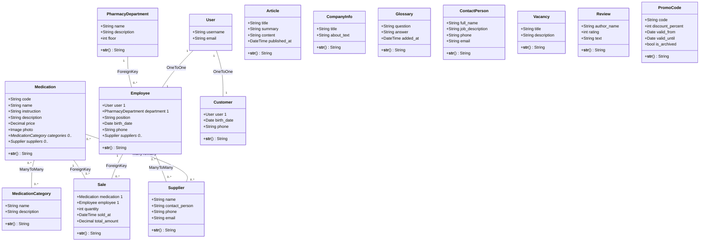

# Диаграмма предметной области «Аптека»

Стиль — UML class diagram (как в учебном примере библиотеки MDN).

## Типы связей (п.3 ТЗ)

| Тип | Реализация |
|-----|------------|
| **OneToOne** | `Employee.user`, `Customer.user` |
| **ForeignKey** | `Sale.employee`, `Sale.medication`, `Employee.department` |
| **ManyToMany** | `Medication.categories`, `Medication.suppliers`, `Employee.suppliers` |

## Отличие сущностей

- **Employee** — сотрудник аптеки (продажи, отдел, поставщики).
- **ContactPerson** — контакты для публичной страницы сайта (не связан с `User`).
- **Customer** — покупатель (клиент = покупатель).
